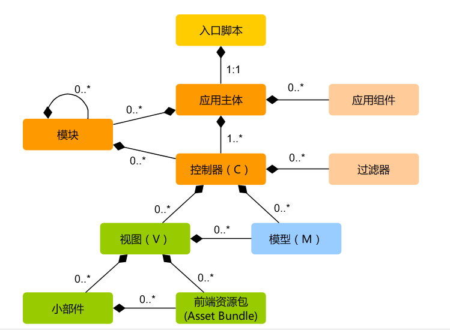

### [运行应用](https://www.yiiframework.com/doc/guide/2.0/zh-cn/start-workflow)


控制台脚本叫 `yii`，它位于应用程序根目录。它可以用于程序的后台运行和维护任务，在[控制台应用程序章节](https://www.yiiframework.com/doc/guide/2.0/zh-cn/tutorial-console)中描述。


----

### 应用结构

应用中最重要的目录和文件（假设应用根目录是 `basic`）:

```

basic/  应用根目录

	composer.json Composer 配置文件，描述包信息
	config/ 包含应用配置及其他配置
		console.php 控制台应用配置信息
		web.php Web 应用配置信息
	
	commands/ 包含控制台命令类
	controllers/ 包含控制器类
	models/ 包含模型类
	runtime/ 包含 Yii 在运行时生成的文件，例如日志和缓存文件
	vendor/ 包含已经安装的 Composer 包，包括 Yii 框架自身
	views/ 包含视图文件
	web/ Web 应用根目录，包含 Web 入口文件
		assets/ 包含 Yii 发布的资源文件（javascript 和 css）
		index.php 应用入口文件
	yii	Yii 控制台命令执行脚本
	
```

models 目录包含了所有[模型类](https://www.yiiframework.com/doc/guide/2.0/zh-cn/structure-models)， views 目录包含了所有[视图脚本](https://www.yiiframework.com/doc/guide/2.0/zh-cn/structure-views)，controllers 目录包含了所有[控制器类](https://www.yiiframework.com/doc/guide/2.0/zh-cn/structure-controllers)


应用的静态结构：




入口脚本接受一个 Web 请求并创建[应用](https://www.yiiframework.com/doc/guide/2.0/zh-cn/structure-application)实例去处理它。
[应用](https://www.yiiframework.com/doc/guide/2.0/zh-cn/structure-application)在它的[组件](https://www.yiiframework.com/doc/guide/2.0/zh-cn/concept-components)辅助下解析请求，并分派请求至 MVC 元素。[视图](https://www.yiiframework.com/doc/guide/2.0/zh-cn/structure-views)使用[小部件](https://www.yiiframework.com/doc/guide/2.0/zh-cn/structure-widgets)去创建复杂和动态的用户界面。

----

### 请求生命周期


1. 用户向入口脚本 `web/index.php` 发起请求。（发起请求）
2. 入口脚本加载应用配置并创建一个应用实例去处理请求。（加载配置-创建实例处理请求）
3. 应用通过请求组件解析请求的路由。（请求组件-解析请求路由）
4. 应用通过创建一个控制器实例去处理请求。（应用创建控制器实例-处理请求）
5. 控制器创建一个动作实例并针对操作执行过滤器。（控制器创建动作实例——对操作执行过滤器）
6. 如果任何一个过滤器返回失败，则动作取消。（过滤器失败-动作取消）
7. 如果所有过滤器都通过，动作将被执行。（过滤器通过-动作执行）
8. 动作会加载一个数据模型，或许是来自数据库。（动作加载数据模型）
9. 动作会渲染一个视图，把数据模型提供给它。（动作渲染视图——提供数据模型给视图）
10. 渲染结果返回给响应组件。（结果给响应组件）
11. 响应组件发送渲染结果给用户浏览器。（结果给用户）


