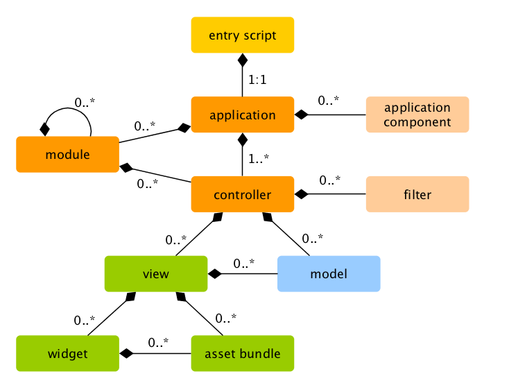
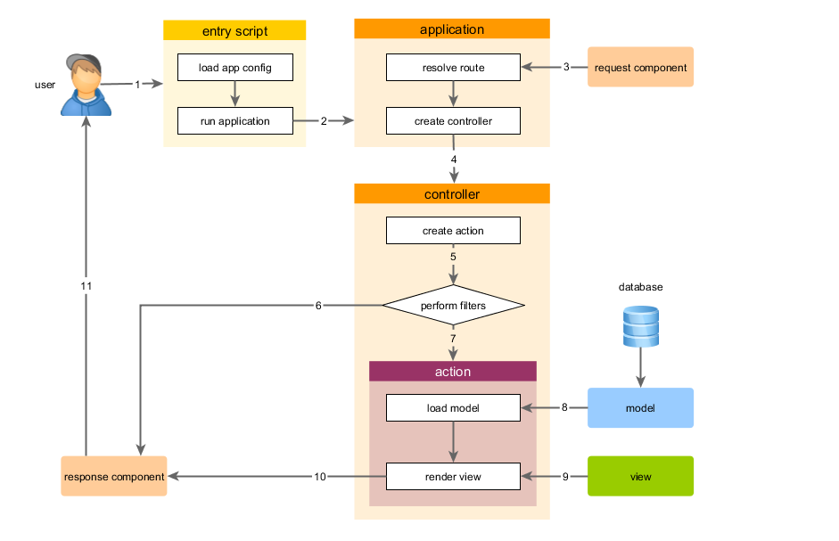

In general, the files in the application can be divided into two types: those under `basic/web` and those under other directories.

The former can be directly accessed via HTTP(i.e, in a browser), while the latter can not and should not be.

Each application has an entry script `web/index.php` which is the only Web accessible PHP script in the application.

The entry script takes an incoming request and creates an ***application*** instance to handle it.

The ***application*** resolves the request with the help of its ***components***, and dispatches the request to the MVC elements. Widgets are used in the vies to help build complex and dynamic user interface elements.

    A user makes a request to the entry script web/index.php.
    The entry script loads the application configuration and creates an application instance to handle the request.
    The application resolves the requested route with the help of the request application component.
    The application creates a controller instance to handle the request.
    The controller creates an action instance and performs the filters for the action.
    If any filter fails, the action is cancelled.
    If all filters pass, the action is executed.
    The action loads some data models, possibly from a database.
    The action renders a view, providing it with the data models.
    The rendered result is returned to the response application component.
    The response component sends the rendered result to the user's browser.

